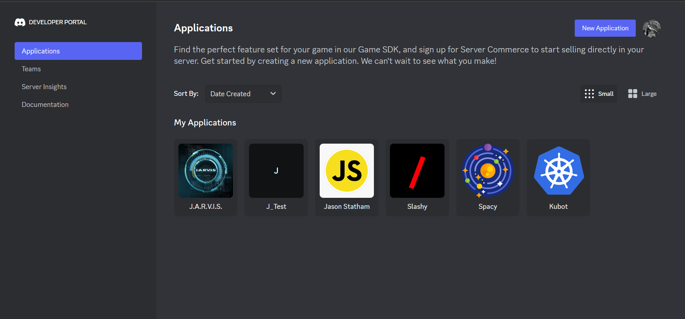

# Kubot

<br>**Kubot** is a Discord bot that aims to facilitate the moderation of small and large servers and to provide users with information about the server, its channels, users, and more.

Interaction with the project is convenient and easy to understand as it uses the widely used video and text-sharing platform Discord. You just need to type **/** in a channel, find the bot commands, and choose the one you need according to their descriptions.

Kubot offers a set of 10 useful commands that are divided into two categories:
> - [**Moderation**](#moderation)
> - [**Info**](#info)

## Commands
### Moderation
There are **5** commands in this category. They offer a convenient way to organize and regulate the participants in a server. Following is a table that describes each command, their arguments, and the permissions you need to use them.
<br><br>

> | Command | Arguments | Needed Permissions | Description |
> | :--------: | :-------: | :--------: |  :------------------------- |
> | **/ban** | `member`, <`reason`> | `ban_members`, `manage_roles` | *Given member of the current server is banned from it.* |
> | **/kick** | `member`, <`reason`> | `kick_members`, `manage_roles` | *Given member of the current server is kicked from it.* |
> | **/clear** | `amount` | `manage_messages` | *Deletes a specific number of messages in a given text channel.* |
> | **/nick** | `member`, `nick` | `manage_nicknames` | *Changes member's nickname in the current server.* |
> | **/reset_nick** | `member` | `manage_nicknames` | *Resets member's nickname in the current server.* |

> **NOTE:** *`<>` denotes arguments that are optional to enter when using the specific command*

### Info
The Discord bot also provides **5** commands that inform users about various aspects of a given server - channels, users, emojis, roles, and more, as well as statistics about the bot itself.
<br><br>

> | Command | Arguments | Needed Permissions | Description |
> | :--------: | :-------: | :--------: |  :------------------------- |
> | **/server_info** | `None` | `None` | *Provides information about the current server.* |
> | **/channel_info** | <`channel`> | `None` | *Provides information about the current or a given channel.* |
> | **/profile** | `member` | `None` | *Provides member's information from the current server.* |
> | **/stats** | `None` | `None` | *If you want to see this bot's stats, this is the way to do it.* |
> | **/ping** | `None` | `None` | *Provides the latency of the bot.* |

> **NOTE:** *`<>` denotes arguments that are optional to enter when using the specific command*

## Dependencies
- [Docker Desktop](https://www.docker.com/products/docker-desktop/) - Used for building, shipping, and running the application using containers. Provides a built-in Kubernetes feature for scalability and container management.

- [Kubernetes CLI](https://kubernetes.io/docs/tasks/tools/) - Used for management and deployment of the application.

- [Minikube](https://minikube.sigs.k8s.io/docs/start/) - Initializes and starts a local Kubernetes cluster used for the application's deployment.

### PIP modules
[**Python**](https://www.python.org/) is the programming language in which this Discord bot is written. The version of the language used is **3.11.4**. Here are listed all the modules that are needed for the implementation, their versions and usage:
<br><br>

> | Module | Version | Usage |
> |:-------------:|:----------:|:----------|
> | ``nextcord`` | **2.3.2** | *For implementing all commands and events, loading them from the bot and connecting the bot to Discord;* |
> | ``python-dotenv`` | **Standard module** | *For loading the bot's configurations from .env file;* |
> | ``os`` | **Standard Module** | *To load the files with the different bot commands;* |
> | ``datetime`` | **Standard module** | *To get an idea of the date and time;* |
> | ``termcolor`` | **2.1.1** | *For color text formatting in the terminal;* |

## Installation Guide
**Step 1:** Go to [Discord Developer Portal](https://discord.com/developers/applications)


<br>

**Step 2:** Click ``New Application`` and set the bot name


<br>

**Step 3:** Click ``Bot`` and copy bot's token


<br>

**Step 4:** Go to ``OAuth2`` -> ``URL Generator`` and select these options:


Copy the generated URL and invite your bot to a server.


<br>

**Step 5:** Insert the bot token in the **.env-template** file, as well as the server ID and channel ID that will be used for notifications when the bot is online. After that remove **-template** from the file name.

```md
TOKEN=<place bot's token here>
HOME_SERVER_ID=<place server's ID here>
ON_READY_CHANNEL_ID=<place channel's ID here>
```

**Step 6:** Run ``Docker Desktop``, go to ``Settings`` -> ``Kubernetes`` and click on ``Enable Kubernetes``


<br>

> **NOTE:** *If Docker Engine and Kubernetes are running, there will be two green buttons in the bottom left corner of the window*

<br>


<br>

**Step 7:** Create bot's docker image using this command in the main directory of the project:

```docker build -t kubot-discord-bot .```

> **NOTE:** *You can check if the image was built by using the command ```docker images```*

<br>

**Step 8:** Start a local Kubernetes cluster

```minikube start```

<br>

**Step 9:** Create the Kubernetes service and deployment defined in the **deployment.yaml** file to a Kubernetes cluster.

```kubectl apply -f deployment.yaml```

<br>
Finnally you should have something like this:


Once the application is started, Kubot will be online and ready to be used.